# Kepler Exoplanet Classification


A machine learning project that classifies Kepler Objects of Interest (KOIs) as `CONFIRMED` exoplanets or `FALSE POSITIVES` detections, built across ten progressive analysis phases and shipped as an interactive Streamlit dashboard.

## Table of Contents

- [Overview](#overview)
- [Project Structure](#project-structure)
- [Dataset](#dataset)
- [Methodology](#methodology)
- [Key Finding](#key-finding)
- [Methodology Audit](#methodology-audit)
- [Dashboard Walkthrough](#dashboard-walkthrough)
- [Running the Dashboard](#running-the-dashboard)
- [Results Summary](#results-summaryfull-feature-tier)

## Overview

Using NASA's Kepler mission data, this project explores what physical and vetting-pipeline signals actually separate real exoplanets from false positives, build and rigorously validates several classifiers, and packages the results into a five-tab dashboard for exploration and audit.

Best result: **F1 ≈ 0.996, ROC-AUC ≈ 0.999** (full feature set) - with a deliberate ablation showing that even without vetting-derived features (`koi_score`, `koi_fpflag_`), raw physical measurements alone still support a strong classifier (**F1 ≈ 0.93-0.94**).

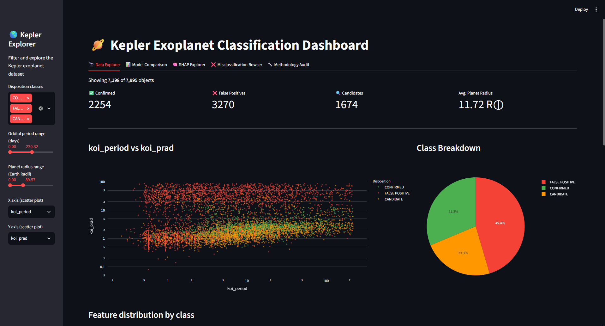

## Project Structure

```
Kepler-Exoplanet-Project/
├── assets/
│ └── dashboard/ # Screenshots of each dashboard tab, for the README/portfolio
│ ├── data_explorer_correlation.png
│ ├── data_explorer_features.png
│ ├── data_explorer_overview.png
│ ├── methodology_audit_1.png
│ ├── methodology_audit_2.png
│ ├── misclassification_browser.png
│ ├── model_comparison_1.png
│ ├── model_comparison_2.png
│ ├── model_comparison_3.png
│ ├── shap_explorer_full_tier.png
│ └── shap_explorer_raw_physical.png
├── dashboard_data/ # Generated by Phase10.ipynb — required before running app.py
│ ├── metrics.json
│ ├── predictions.json
│ ├── shap_values_full.npy
│ ├── shap_values_raw.npy
│ ├── test_metadata.csv
│ ├── X_test_full.csv
│ ├── X_test_raw.csv
│ ├── xgb_full_model.pkl
│ ├── xgb_raw_model.pkl
│ └── y_test.npy
├── data/
│ ├── cumulative.csv # Raw NASA Exoplanet Archive export
│ └── kepler_clean.csv # Cleaned dataset used from Phase 1 onward
├── docs/
│ ├── kepler_correlation_matrix.png
│ ├── kepler_feature_distributions.png
│ └── kepler_overview.png
├── outputs/ # Saved plots/artifacts generated across all phases
│ ├── p1_boxplots.png
│ ├── p1_class_distribution.png
│ ├── p1_distribution.png
│ ├── p1_violin_plots.png
│ ├── p2_correlation_heatmap.png
│ ├── p2_target_correlation.png
│ ├── p3_boxplots_interactive.html
│ ├── p3_correlation_heatmap.html
│ ├── p3_histogram_radius.html
│ ├── p3_pairplot.png
│ ├── p3_scatter_radius_period.html
│ ├── p4_confusion_matrices.png
│ ├── p4_feature_importance.png
│ ├── p4_roc_curves.png
│ ├── p6_koi_score_misclassified.png
│ ├── p6_misclassification_analysis.png
│ ├── p6_shap_importance_bar.png
│ ├── p6_shap_physical_only.png
│ ├── p6_shap_summary.png
│ ├── p7_learning_curves.png
│ ├── p8_shap_raw_physical.png
│ └── p8_shap_raw_physical_bar.png
├── kepler-env/ # Local virtual environment (not tracked in git)
├── app.py # Multi-tab Streamlit dashboard
├── Kepler_DA_Phase1.ipynb # EDA: class distribution, distributions, box/violin plots
├── Kepler_DA_Phase2.ipynb # Correlation analysis, outlier detection
├── Kepler_DA_Phase3.ipynb # Interactive Plotly visualizations
├── Kepler_DA_Phase4.ipynb # Baseline models (RF, XGBoost, GB) + cross-validation
├── Kepler_DA_Phase5.ipynb # (early modeling / transition into Phase 6)
├── Kepler_DA_Phase6.ipynb # SVM, SHAP interpretability, ablations, McNemar's tests
├── Kepler_DA_Phase7.ipynb # Overfitting diagnostics: train-vs-CV gap, learning curves
├── Kepler_DA_Phase8.ipynb # Feature-tier ablation (Full / No koi_score / Raw Physical)
├── Kepler_DA_Phase9.ipynb # Additional models: Logistic Regression, LightGBM
├── Kepler_DA_Phase10.ipynb # Exports all results/models to dashboard_data/
├── .gitattributes
├── .gitignore
├── LICENSE
├── README.md
└── requirements.txt
```

## Dataset

- Source: Kepler Objects of Interest (`kepler_clean.csv`) - 7,995 objects, acquired from Kaggle
- Target: `koi_disposition` - modeled as a binary task, `CONFIRMED` vs `FALSE POSITIVE` (`CANDIDATE` rows are excluded from training but included in dashboard exploration)
- Key features (16 total):
  `koi_period`, `koi_prad`, `koi_teq`, `koi_insol`, `koi_model_snr`, `koi_steff`, `koi_slogg`, `koi_srad`, `koi_score`, `koi_depth`,
  `koi_duration`, `koi_impact`, `koi_fpflag_nt`, `koi_fpflag_ss`,`koi_fpflag_co`, `koi_fpflag_ec`

## Methodology

1. **EDA & statistics** (Phase 1-2) - missing values, distriutions, ANOVA, correlation analysis, IQR outlier detection, class separation checks.
2. **Visualization** (Phase 3) - interactive Plotly scatter/box/heatmap/pair plots of key features by class.
3. **Modeling** (Phase 4-10) - Logistic Regression, Random Forest, Gradient Boosting, SVM, XGBoost, and LightGBM, trained with:
   - Median imputation (fit inside the CV/train split only)
   - SMOTE oversampling for class balance (applied after the train/test split)
   - Feature scaling for distance/gradient-based models (SVM, Logistic Regression)
   - **Star-grouped train/test split** (`GroupShuffleSplit` on rounded RA/Dec) to prevent host-star leakage between train and test
4. **Feature-tier ablation** - every model is evaluated across three feature tiers to separate "real" physical signal from pipeline-derived shortcuts:
   - **Full** - all 16 features
   - **No koi_score** - drops the vetting score only
   - **Raw Physical** - drops `koi_score` _and_ `koi_fpflag_*` vetting flags
5. **Statistical validation** - McNemar's test for pairwise model comparison significance
6. **Interpretability** - SHAP (TreeExplainer) for Full and Raw Physical XGBoost models.

## Key Finding

Dropping `koi_score` and the `koi_fpflag_*` vetting flags causes a statistically significant performance drop (McNemar's p < 0.0001) - these features account for a real share of the near-perfect full-feature scores. However, raw physical measurements alone (period, radius, depth, duration, SNR, stellar parameters) still supports a genuinely strong classifier (best: XGBoost, F1 ≈ 0.94) - confirming independently learnable physical signal, not just agreement with Kepler's own automated vetting pipeline.

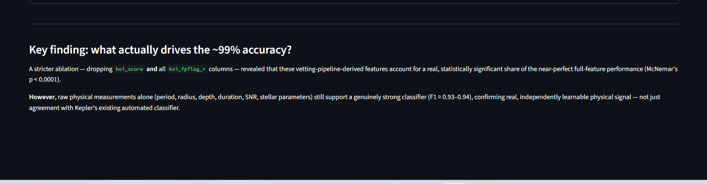

## Methodology Audit

Six issues were identified and fixed during development, each verified with before/after results:

1. McNemar's test 0/0 edge case (operator precedence bug: `&` vs `and`)
2. SVM training on the wrong feature scope (Cell 6, full feature comparison)
3. SVM trained on the wrong feature scope (Cell 11, physcial-only ablation - the mirror-image bug that masked #2)
4. SMOTE applied before the CV split (synthetic-point leakage across folds - corrected AUC 0.9987, down from an inflated 0.996)
5. Imputer fit before leakage across train/test split (17.4% of test rows shared a host star with a training row) - fixed with `GroupShuffleSplit`

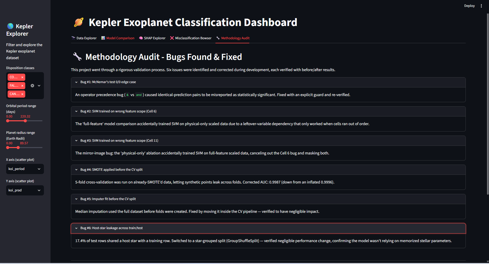

## Dashboard Walkthrough

### 🔭 Data Explorer

Filter by disposition class, orbital period, and planet radius; explore the period-radius scatter, class breakdown, feature distribution by class, and a correlation heatmap across key features.


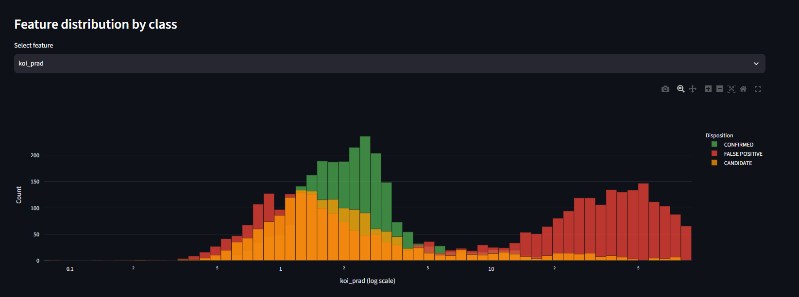
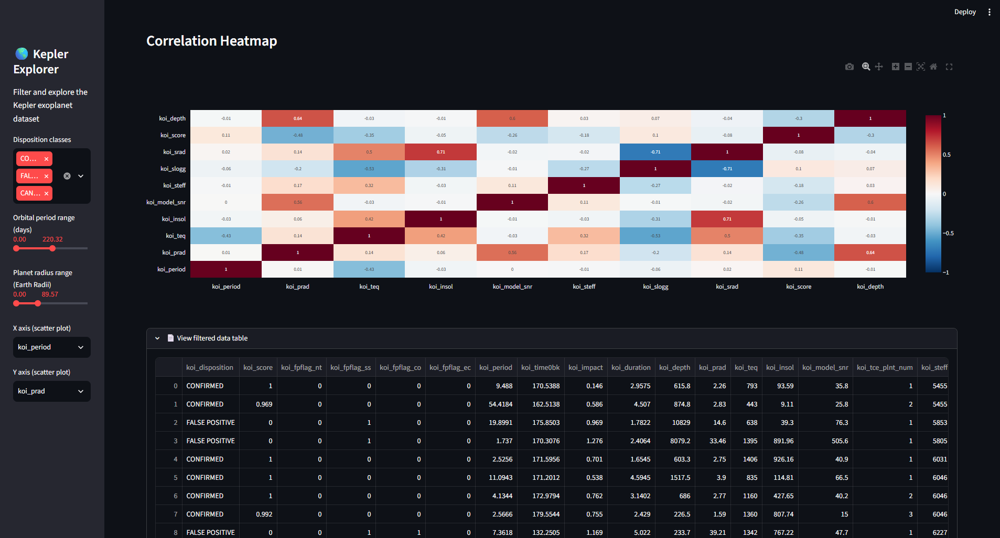

### 📊 Model Comparison

Toggle between the Full, No koi_score, Raw Physical feature tiers to see F1/ROC-AUC for all six models, plus a per-model confusion matrix.

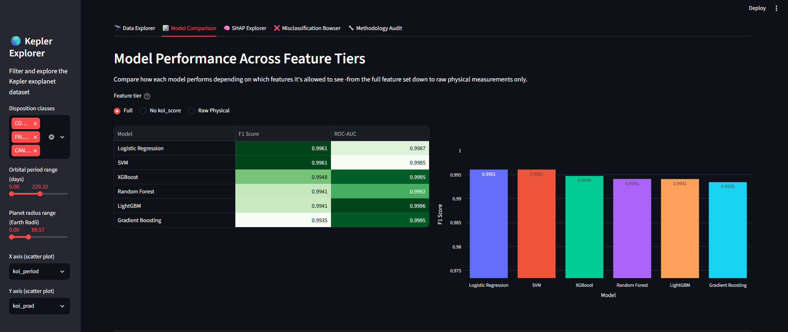
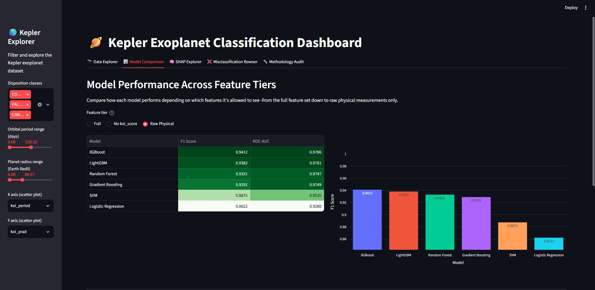
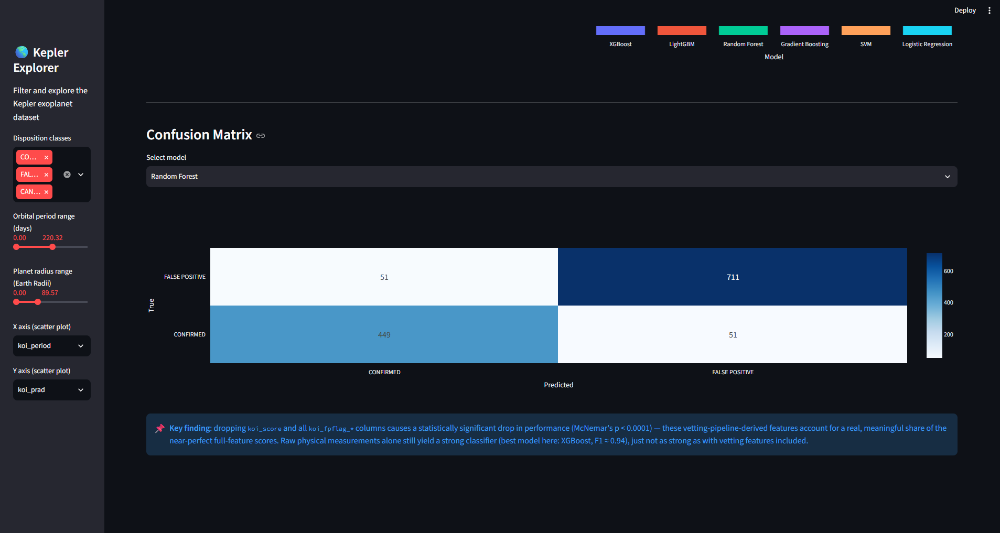
_Confusion Matrix shown for Random Forest as an example - the dropdown lets you pick any of the six models live_

### SHAP Explorer

Mean |SHAP Explorer| feature importance, toggleeable between Full and Raw Physical tiers.

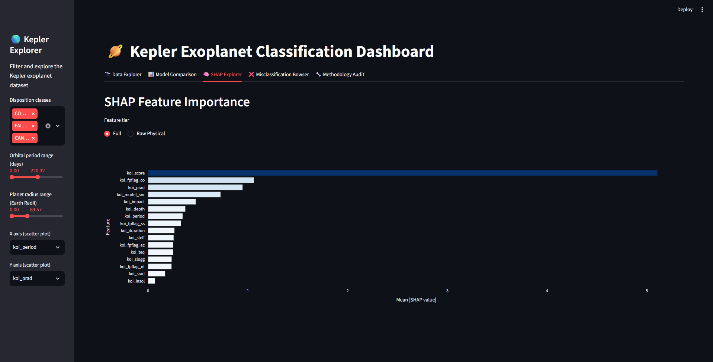
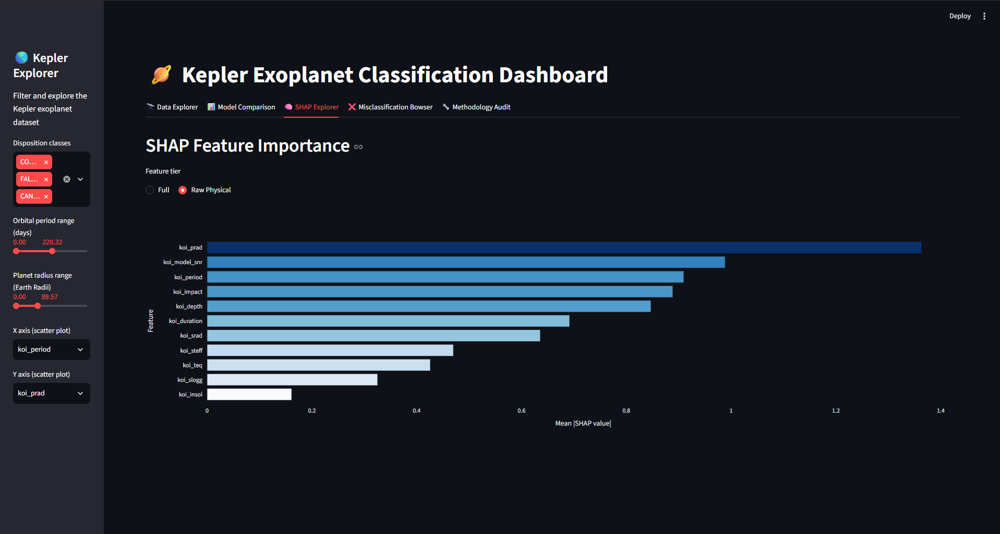

### ❌ Misclassification Broweser

Inspect misclassified test objects for a selected model, alongside a `koi_score` distribution comparing correct vs. misclassified predictions.

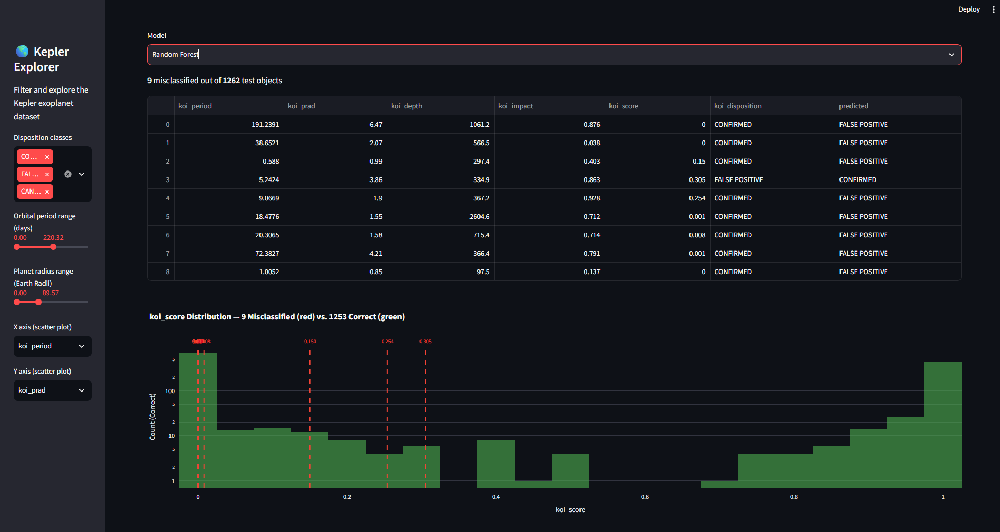
_Shown for Random Forest as an example - switch models in the dropdown to see others_

### 🔧 Methodology Audit

See the [Methodology Audit](#methodology-audit) section above.

## Running the dashboard

```bash
pip install streamlit pandas numpy plotly
streamlit run app.py
```

> Note: `app.py` currently at a hardcoded local path
> (`C:\Users\adity\Desktop\Kepler-Exoplanet Project`). Update `BASE` in
> `app.py` to your local project directory before running

## Tech Stack

- **Data/ML**: pandas, NumPy, scikit-learn, XGBoost, LightGBM, imbalanced-learn (SMOTE), statsmodels (McNemar), SHAP
- **visualization**: Matplotlib, Seaborn, Plotly
- **Dashboard**: Streamlit
- **Model persistence**: joblib

## Results Summary(Full feature tier)

| Model               | F1     | ROC-AUC |
| ------------------- | ------ | ------- |
| Logistic Regression | 0.9961 | 0.9987  |
| SVM                 | 0.9961 | 0.9985  |
| XGBoost             | 0.9948 | 0.9995  |
| Random Forest       | 0.9941 | 0.9992  |
| LightGBM            | 0.9941 | 0.9996  |
| Gradient Boosting   | 0.9935 | 0.9995  |

| Model               | F1 (Raw Physical) | ROC-AUC (Raw Physical) |
| ------------------- | ----------------- | ---------------------- |
| XGBoost             | 0.9412            | 0.9786                 |
| LightGBM            | 0.9382            | 0.9781                 |
| Random Forest       | 0.9331            | 0.9747                 |
| Gradient Boosting   | 0.9291–0.9297     | 0.9749                 |
| SVM                 | 0.8875            | 0.9535                 |
| Logistic Regression | 0.8622            | 0.9280                 |

## Future Work

- Extend classification to the `CANDIDATE` class using the trained models as a starting point
- Investigate the 9 hard misclassified cases for potential label noise
- Adding a stacking ensemble on the Raw Physical tier, where model diversity is higher

## Acknowledgments

- Data: [NASA Exoplanet Archive](https://exoplanetarchive.ipac.caltech.edu/) / Kepler cumulative KOI table
- Built as part of personal ML portfolio project

## Author

**Aditya**
Github: [@aditya-patra1011](https://github.com/aditya-patra1011)
Portfolio: [portfolioaditya-pearl.vercel.app](https://portfolioaditya-pearl.vercel.app)

## LICENSE

This project is licensed under the terms of the LICENSE file included in this repository.
